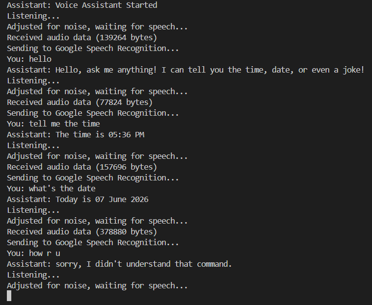
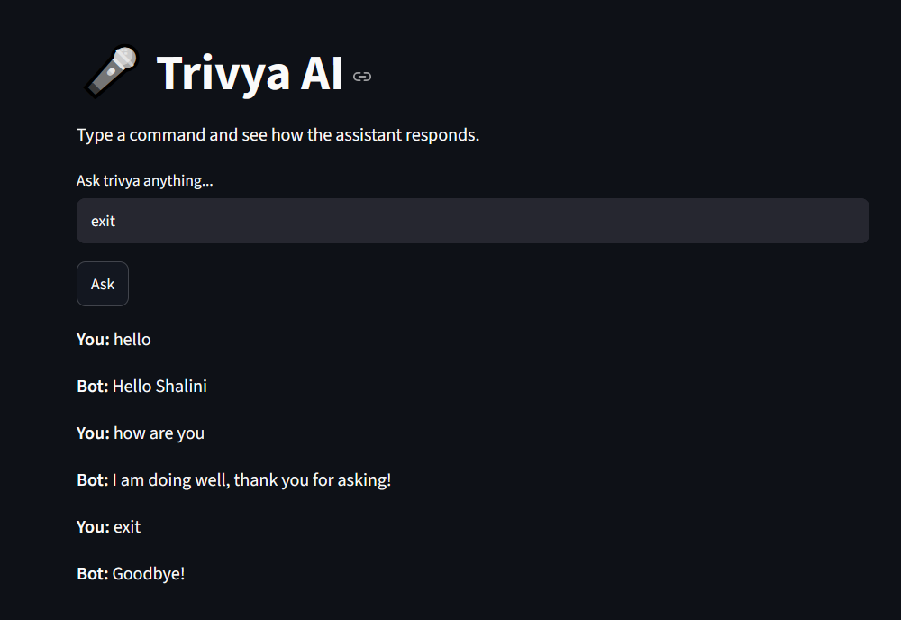

# Trivya AI 

Trivya AI is a Python-based voice assistant that combines speech recognition, text-to-speech, and Google Gemini AI to provide an interactive assistant experience. Users can interact through both a terminal-based voice interface and a Streamlit-powered web interface.

The project can answer questions using AI, perform basic assistant tasks, open websites, and respond through voice output.

---

## Features

- Voice recognition using SpeechRecognition
- Text-to-speech responses using pyttsx3
- AI-powered responses using Google Gemini
- Streamlit-based web interface
- Current date and time information
- Website launching (Google, YouTube, GitHub)
- Greetings and conversational responses
- Joke generation
- Environment variable security using .env
- Error handling for microphone and network issues

---

## Screenshots

### Voice Assistant



### Streamlit Interface



---

## Technologies Used

* Python
* Streamlit
* SpeechRecognition
* PyAudio
* pyttsx3
* webbrowser
* datetime
* Google Gemini API
* python-dotenv

---

## Project Structure

VoiceAssistant/
│
├── main.py
├── streamlit_app.py
├── ai_helper.py
├── requirements.txt
├── README.md
├── .gitignore
├── assets/
└── .env (not included in repository)

## Installation

### 1. Clone the Repository

```bash
git clone https://github.com/shalinitiwari-25/Voice-Assistant.git
```

### 2. Navigate to the Project Directory

```bash
cd Voice-Assistant
```

### 3. Create and Activate a Virtual Environment (Optional)

Windows:

```bash
python -m venv venv
venv\Scripts\activate
```

Linux/macOS:

```bash
python3 -m venv venv
source venv/bin/activate
```

### 4. Install Dependencies

```bash
pip install -r requirements.txt
```
### 5. Create a `.env` file

Create a file named `.env` in the project root directory and add your Gemini API key:

```env
GEMINI_API_KEY=your_api_key_here
```
---

## Running the Project

### Voice Assistant Mode

Run the terminal-based voice assistant:

```bash
python main.py
```

### Web Interface Mode

Run the Streamlit application:

```bash
streamlit run streamlit_app.py
```

---

## Example Commands

- Hello
- What is your name?
- What is the time?
- What is the date?
- Tell me a joke
- Open YouTube
- Open Google
- Open GitHub
- What is machine learning?
- Who is Alan Turing?
- Explain Python

---

## Architecture

The project currently provides two user interfaces:

1. **Voice Interface (main.py)**

   * Uses microphone input
   * Converts speech to text
   * Processes commands
   * Responds using text-to-speech

2. **Web Interface (streamlit_app.py)**

   * Uses a browser-based interface
   * Accepts text commands
   * Displays responses on the webpage

Both interfaces provide similar assistant capabilities, allowing users to interact through either voice or text.

---

## Finish-Up-A-Thon Improvements

This project originally started as a terminal-based voice assistant.

During the GitHub Finish-Up-A-Thon, I improved the project by:

- Adding a Streamlit web interface
- Integrating Google Gemini AI
- Securing API keys using environment variables
- Improving project documentation
- Adding screenshots and usage examples
- Enhancing project structure and usability

---

## Future Improvements

- Voice input support in the web interface
- Weather and news integration
- Multilingual support
- Wake-word activation
- Conversation memory
- Cloud deployment

---

## Author

**Shalini Tiwari**

Aspiring Software Developer | Open Source Contributor | AI Enthusiast

GitHub: https://github.com/shalinitiwari-25

---

## Project Goal

The goal of Trivya AI is to demonstrate how speech recognition, text-to-speech systems, and web interfaces can be combined to build an interactive assistant capable of performing everyday tasks through natural user interaction.
